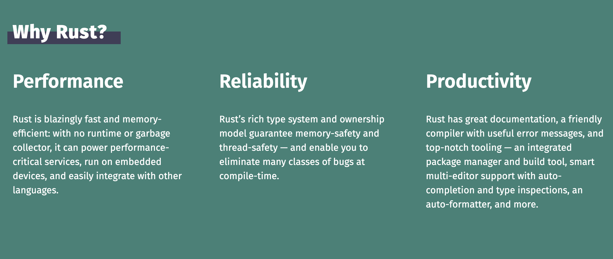
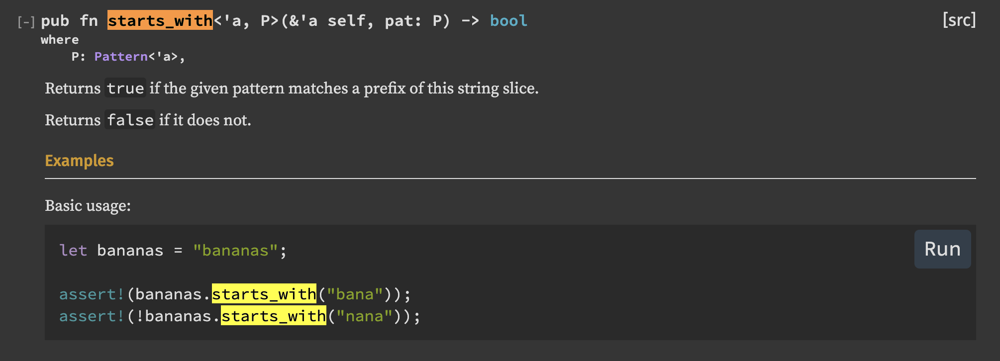
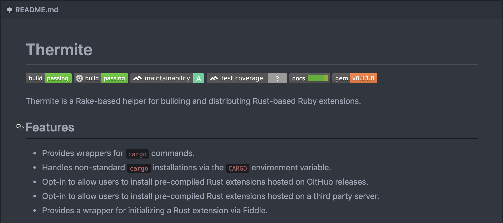
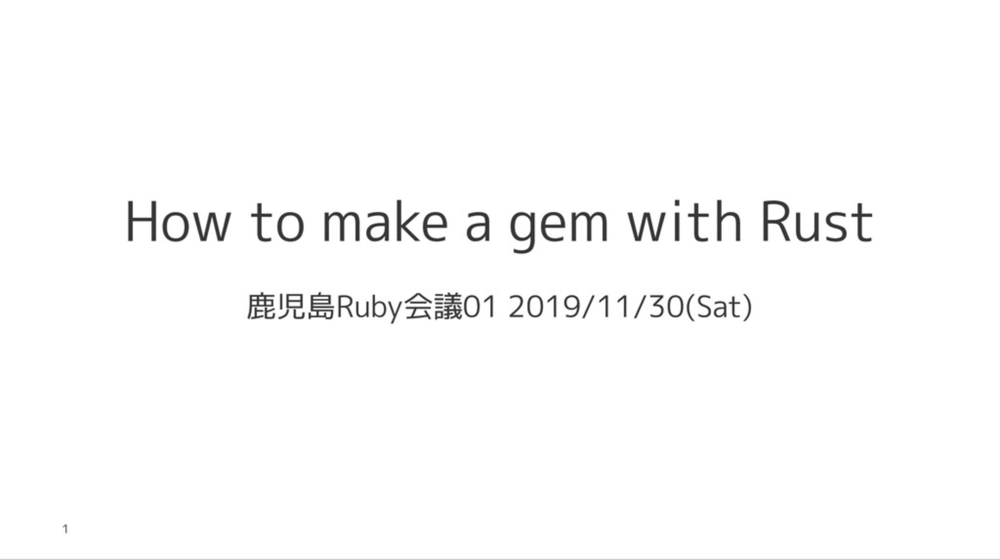
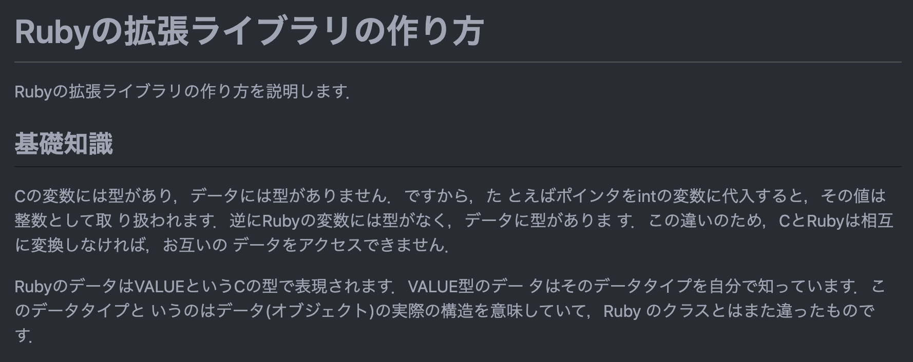
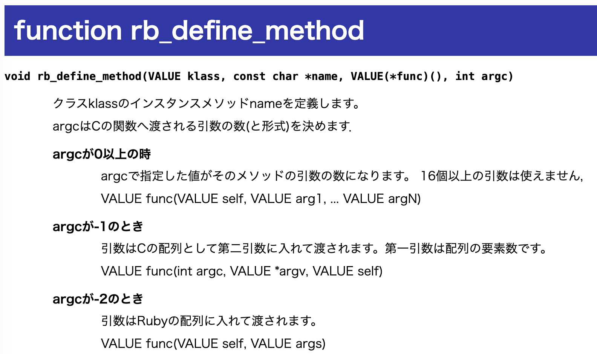

<!-- _class: lead -->
# RustでGemを作ろう
Akifumi Tomiyama
スタディプラス株式会社
平成Ruby会議01

---

## whoami

- 冨山晶史(Tomiyama Akifumi)
- Birthday = Date.new(1991, 12, 16) # H3
- スタディプラス株式会社
- Ruby歴 2年
- Rust歴 3ヶ月
- twitter: @atomiyama1216

---

## Rustとは



<!--
footer: https://ja.wikipedia.org/wiki/Rust_(%E3%83%97%E3%83%AD%E3%82%B0%E3%83%A9%E3%83%9F%E3%83%B3%E3%82%B0%E8%A8%80%E8%AA%9E)
-->

---

## Rustの特徴

- 実行速度が早い
- メモリ，スレッド安全
（所有権，参照と借用）
- パターンマッチ，代数的データ型など
- パッケージマネージャ（cargo） ...etc

```
fn main() {
  let foo = String::from("foo");
  let _baz = foo;
  println!("{}", foo);
}
//=> error[E0382]: borrow of moved value: `foo`
```

<!-- footer: '' -->

---

## RustでGemを作る動機

Rubyが苦手なところをRustで補いたい
- Rubyの書きやすさ
- Rustの高速性, 安全性

2つの言語の良いところをあわせて開発したい

---

## Rubyから他言語を使う方法

#### 拡張ライブラリ
公開されているCのAPIを使用する方法
-> mysql2, nokogiri
e.g. `rb_define_method`

#### FFI(Foreign Function Interface)
関数などのシグネチャをRubyから渡して呼び出す
https://github.com/ffi/ffi

---

## 今回実装するもの

`String#start_with?`,`String#end_with?`と同等のものをSymbolクラスに実装する
```ruby
:some_symbol.start_with?(:some)   #=> true
:some_symbol.start_with?(:symbol) #=> false

:some_symbol.end_with?(:some)     #=> false
:some_symbol.end_with?(:symbol)   #=> true
```

https://github.com/atomiyama/rusty_symbol

---

## やること
`Symbol#start_with?`, `Symbol#end_with?`を定義する


<!--
footer: https://doc.rust-lang.org/std/primitive.str.html#method.starts_with
-->

---

<!-- footer: '' -->
## gemを作るには

1. gemプロジェクトの作成
```bash
> bundle gem GEM_NAME
```

2. ビルド周りの設定
`GEM_NAME.gemspec`, `Rakefile`

3. 実装
Rust書く〜〜😇

---

<!-- _class: lead -->
# 1. gemプロジェクトの作成

---

## gemプロジェクトの作成

```
> bundle gem rusty_symbol --ext
```
- rake-compiler
C拡張ではrake compilerが使えるがrustは未サポート

- Thermite
RustベースのRuby拡張のビルドを支援してくれるライブラリ

---

<!-- _class: lead -->
# 2. ビルド周りの設定

---

## Thermite
https://github.com/malept/thermite


---

## ビルド周りの設定

[@sinsoku_listy](https://twitter.com/sinsoku_listy)さんの発表を参考にしました



---

## ビルド周りの設定
```ruby
# rusty_symbol.gemspec
Gem::Specification.new do |spec|
  spec.name          = "rusty_symbol"
  ...
  spec.require_paths = ["lib"]
  spec.extensions = ['ext/rusty_symbol/extconf.rb']

  spec.add_dependency "thermite"

  spec.add_development_dependency "bundler", "~> 1.17"
  spec.add_development_dependency "rake", "~> 10.0"
  ...
end

```

---

## ビルド周りの設定

```ruby
# ext/build.rb
require 'thermite/tasks'

Thermite::Config.prepend(
  Module.new do
    def shared_library
      @shared_library ||= "#{library_name}.#{RbConfig::CONFIG["DLEXT"] || 'so'}"
    end

    def ruby_extension_dir
      @ruby_extension_dir ||= @options.fetch(:ruby_extension_dir, 'lib')
    end

    def ruby_extension_path
      ruby_path(ruby_extension_dir, shared_library)
    end
  end
)

project_dir = File.dirname(File.dirname(__FILE__))
Thermite::Tasks.new(cargo_project_path: project_dir,
                    ruby_project_path: project_dir,
                    ruby_extension_dir: "lib/rusty_symbol")
```

---

## ビルド周りの設定

```ruby
# Rakefile
require "bundler/gem_tasks"
require "rspec/core/rake_task"
require_relative "ext/build"

RSpec::Core::RakeTask.new(:spec)

require "rake/extensiontask"

task build: "thermite:build"

Rake::ExtensionTask.new("rusty_symbol") do |ext|
  ext.lib_dir = "lib/rusty_symbol"
end

task :default => [:clobber, "thermite:build", :spec]
```

---

## Cargoでプロジェクトを作成

```bash
# ライブラリテンプレートの生成
> cargo init --lib
```

- Cargo.toml
- src/lib.rs
が作成される.

---

## Cargo.tomlの設定

libcはRustにCの型定義を提供してくれます．

```toml
[package]
name = "rusty_symbol"
version = "0.1.0"
authors = ["atomiyama <*****@gmail.com>"]
edition = "2018"

[lib]
path = "src/lib.rs"
crate-type = ["cdylib"]

[dependencies]
libc = "*"
```

---

## ビルドしてみる

これでやればビルドが通るようになりました．

```bash
❯ rake build
checking for cargo... yes
...
rusty_symbol 0.1.0 built to pkg/rusty_symbol-0.1.0.gem.
```

---

<!-- _class: lead -->
# 3. Rust書く〜〜😇

---

## Hello world
```rust
// src/lib.rs
#[no_mangle]
pub extern "C" fn Init_rusty_symbol() {
  println!("hello 平成Ruby会議01");
}
```
```bash
> rake build

> ls lib/rusty_symbol/rusty_symbol.bundle
lib/rusty_symbol/rusty_symbol.bundle

> bin/console
hello 平成Ruby会議01
```
<!--
footer: 'branch: hello_world'
-->

---

<!-- footer: '' -->
## 今回実装するもの

`String#start_with?`,`String#end_with?`と同等のものをSymbolクラスに実装する
```ruby
:some_symbol.start_with?(:some)   #=> true
:some_symbol.start_with?(:symbol) #=> false

:some_symbol.end_with?(:some)     #=> false
:some_symbol.end_with?(:symbol)   #=> true
```

---

## やること
`Symbol#start_with?`, `Symbol#end_with?`を定義する


<!--
footer: https://doc.rust-lang.org/std/primitive.str.html#method.starts_with
-->

---

## RubyはVALUE

```c
// ruby.h
// https://github.com/ruby/ruby/blob/v2_6_5/include/ruby/ruby.h#L94-L115
typedef unsigned long VALUE;
```



<!--
footer: https://github.com/ruby/ruby/blob/master/doc/extension.ja.rdoc#%E5%9F%BA%E7%A4%8E%E7%9F%A5%E8%AD%98
 -->

---

## Ruby C API

<!--
footer: https://docs.ruby-lang.org/ja/latest/function/rb_define_method.html
-->


---

## 関数シグネチャをRustで定義
`rb_define_method`を定義する

```rust
extern crate libc;
use libc::{ c_ulong };

type VALUE = c_ulong;

extern {
  fn rb_define_method(klass: VALUE,
                      name: *const c_char,
                      func: c_func,
                      argc: c_int);
}
```

---

## SymbolクラスをRustで定義
```c
// string.c
rb_cSymbol = rb_define_class("Symbol", rb_cObject);
```

```rust
// src/lib.rs
extern crate libc;
use libc::{ c_ulong };

type VALUE = c_ulong;

extern {
  static rb_cSymbol: VALUE;
}
```

<!--
footer: https://github.com/ruby/ruby/blob/master/string.c#L11369
-->

