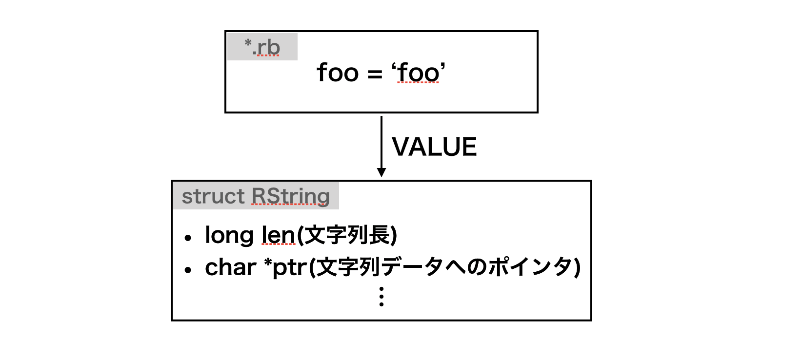

<!-- _class: lead -->
# RustでGemを作ろう
Akifumi Tomiyama
スタディプラス株式会社
平成Ruby会議01

---

## whoami

- 冨山晶史(Tomiyama Akifumi)
- Birthday = Date.new(1991, 12, 16) # H3
- スタディプラス株式会社
- Ruby歴 2年
- Rust歴 3ヶ月
- twitter: @atomiyama1216

---

## Rustとは


<!--
_footer: https://www.rust-lang.org/
-->

---

## Rustの特徴

- 速度・安全性・並列性を重視した言語
  - 所有権，参照と借用
  - コンパイラの強力なサポート
  - ジェネリクスなどの型システム

```
fn main() {
  let foo = String::from("foo");
  let _baz = foo;
  println!("{}", foo);
}
//=> error[E0382]: borrow of moved value: `foo`
```

---

## 今日話すこと

- Rustで実装したコードをRubyから呼び出したい
  - Ruby
    - 高い柔軟性と書きやすさ
  - Rust
    - 高い安全性と速度

この2つの言語の良いところをあわせてより良いアプリケーション開発をしたい🥳

---

## RubyからRustを呼び出す方法

#### 拡張ライブラリ
公開されているCのAPIを使用する方法
-> mysql2, nokogiri
e.g. `rb_define_method`

#### FFI(Foreign Function Interface)
関数などのシグネチャをRubyから渡して呼び出す
https://github.com/ffi/ffi

---

## 今回実装したもの

`String#start_with?`,`end_with?`と同等のものをSymbolクラスに拡張するgemを作成する
```ruby
:some_symbol.start_with?(:some)   #=> true
:some_symbol.start_with?(:symbol) #=> false

:some_symbol.end_with?(:some)     #=> false
:some_symbol.end_with?(:symbol)   #=> true
```

https://github.com/atomiyama/rusty_symbol

---

## 今回実装したもの
Rustの関数`starts_with`, `ends_with`を使って
`Symbol#start_with?`, `Symbol#end_with?`を定義する


<!--
_footer: https://doc.rust-lang.org/std/primitive.str.html#method.starts_with
-->

---

<!-- _class: lead -->
# gemを作っていく

---

## gemを作るには

1. gemプロジェクトの作成

2. ビルド周りの設定

3. 実装

4. 公開

---

<!-- _class: lead -->
# 1. gemプロジェクトの作成

---

## gemプロジェクトの作成

```
> bundle gem rusty_symbol --ext
```
- rake-compiler
rake compilerはC拡張のビルドをサポート
rustは未サポート

- Thermite
RustベースのRuby拡張のビルドを支援

---

## Thermite
https://github.com/malept/thermite


---

<!-- _class: lead -->
# 2. ビルド周りの設定

---

## ビルド周りの設定

[@sinsoku_listy](https://twitter.com/sinsoku_listy)さんの発表を参考にしました


<!-- _footer: https://speakerdeck.com/sinsoku/how-to-make-a-gem-with-rust -->

---

## ビルド周りの設定
```ruby
# rusty_symbol.gemspec
Gem::Specification.new do |spec|
  spec.name          = "rusty_symbol"
  ...
  spec.require_paths = ["lib"]
  spec.extensions = ['ext/rusty_symbol/extconf.rb']

  spec.add_dependency "thermite"

  spec.add_development_dependency "bundler", "~> 1.17"
  spec.add_development_dependency "rake", "~> 10.0"
  ...
end

```

---

## ビルド周りの設定

- 共有ライブラリ

|| Dynamic Linking | Dynamic Loading |
| ---- | ---- | ---- |
| linux | .so | .so |
| macOS | .dylib | .bundle |

---

## ビルド周りの設定

```ruby
# ext/build.rb
require 'thermite/tasks'

Thermite::Config.prepend(
  Module.new do
    def shared_library
      @shared_library ||= "#{library_name}.#{RbConfig::CONFIG["DLEXT"] || 'so'}"
    end

    def ruby_extension_dir
      @ruby_extension_dir ||= @options.fetch(:ruby_extension_dir, 'lib')
    end

    def ruby_extension_path
      ruby_path(ruby_extension_dir, shared_library)
    end
  end
)

project_dir = File.dirname(File.dirname(__FILE__))
Thermite::Tasks.new(cargo_project_path: project_dir,
                    ruby_project_path: project_dir,
                    ruby_extension_dir: "lib/rusty_symbol")
```

---

## ビルド周りの設定

```ruby
# Rakefile
require "bundler/gem_tasks"
require "rspec/core/rake_task"
require_relative "ext/build"

RSpec::Core::RakeTask.new(:spec)

require "rake/extensiontask"

task build: "thermite:build"

Rake::ExtensionTask.new("rusty_symbol") do |ext|
  ext.lib_dir = "lib/rusty_symbol"
end

task :default => [:clobber, "thermite:build", :spec]
```

---

<!-- _class: lead -->
# 3. 実装

---

## Cargoでプロジェクトを作成

Rustで実装をするためにcargoでプロジェクトを作成する

```bash
# ライブラリテンプレートの生成
> cargo init --lib
     Created library package

> git status -s
M .gitignore
?? Cargo.toml
?? src/
```

---

## Cargo.tomlの設定

libcはRustにCの型定義を提供してくれます．
.gemspecに似てる

```toml
[package]
name = "rusty_symbol"
version = "0.1.0"
authors = ["atomiyama <*****@gmail.com>"]
edition = "2018"

[lib]
path = "src/lib.rs"
crate-type = ["cdylib"]

[dependencies]
libc = "*"
```
---

## Hello world
`rake build`を実行すると`lib/rusty_symbol/rusty_symbol.bundle`ができる.

```bash
❯ rake build
checking for cargo... yes
...
   Compiling rusty_symbol v0.1.0 (/path/to/rusty_symbol)
    Finished release [optimized] target(s) in 1.36s
rusty_symbol 0.1.0 built to pkg/rusty_symbol-0.1.0.gem.
```

---

## Hello world
requireされた時
`lib/rusty_symbol/rusty_symbol.bundle`の
`Init_rusty_symbol`が呼び出される．

```ruby
# lib/rusty_symbol.rb
require "rusty_symbol/rusty_symbol"
```
```rust
// src/lib.rs
#[no_mangle]
pub extern "C" fn Init_rusty_symbol() {
  println!("hello 平成Ruby会議01");
}
```

---

## Hello world

```bash
# コンパイル
> rake build

# .bundleが生成される
> ls lib/rusty_symbol/rusty_symbol.bundle
lib/rusty_symbol/rusty_symbol.bundle

# 実行
> bin/console
hello 平成Ruby会議01
[1] pry(main)>
```
<!-- _footer: 'branch: hello_world' -->

---

<!-- _class: lead -->
# 今回実装したいものは

---

## Symbol#start_with?

`String#start_with?`(`end_with?`)と同等の挙動をするものをSymbolクラスに移植
```ruby
:some_symbol.start_with?(:some)   #=> true
:some_symbol.start_with?(:symbol) #=> false

:some_symbol.end_with?(:some)     #=> false
:some_symbol.end_with?(:symbol)   #=> true
```

---

## 実装ステップ

1. Rubyの文字列をRustのStringに変換する
2. `start_with?`, `end_with?`を実装
3. Symbolクラスを拡張する


<!-- _footer: https://doc.rust-lang.org/std/primitive.str.html#method.starts_with -->

---

<!-- _class: lead -->
# 1. Rubyの文字列をRustの文字列に変換する

---

## Ruby ObjectはVALUEで構造体

```c
// ruby.h
// https://github.com/ruby/ruby/blob/v2_6_5/include/ruby/ruby.h#L94-L115
typedef unsigned long VALUE;
```



---

<!-- _class: lead -->
## Symbolはちょっと違う

---

## SymbolはID

- Symbol objectのVALUEは構造体を指すポインタではない
- このVALUEはID型の整数値
- IDからCのcharが取り出せる
- **シンボルは文字列の皮を被った整数値**

```c
// https://github.com/ruby/ruby/blob/master/include/ruby/ruby.h#L103
typedef unsigned long ID;
```

<!-- _footer: 'http://i.loveruby.net/ja/rhg/book/object.html' -->

---

## シンボルをRust Stringに変換
1. VALUEをIDに変換
2. IDからCの文字列ポインタを取得
3. Cの文字列をRustのStringに変換

---

## シンボルをRust Stringに変換
1. VALUEをIDに変換

```c
// https://github.com/ruby/ruby/blob/master/symbol.c#L747-L772
ID rb_sym2id(VALUE sym) {
...
}
```

```rust
// src/lib.rs
let id: ID = unsafe { rb_sym2id(rb_self) };
```

---

## シンボルをRust Stringに変換

2. IDからCの文字列を取得
```c
// https://github.com/ruby/ruby/blob/master/symbol.c#L800-L813
const char * rb_id2name(ID id) {
...
}
```

```rust
// src/lib.rs
let cstr: *const c_char = unsafe { rb_id2name(id) };
```

---

## シンボルをRust Stringに変換

3. Cの文字列をRustのStringに変換

```rust
// src/lib.rs
let rstr: String = unsafe {
  CStr::from_ptr(cstr).to_string_lossy().into_owned()
};

```

---

<!-- _class: lead -->
# 2. `start_with?`, `end_with?`を実装

---

## start_with?を実装
1. レシーバと引数を全てRust Stringに変換
2. 与えられた可変長の文字列にstarts_withを実行
3. マッチしたらTrue，なければFalseを返す

---

## start_with?

```rust
extern fn rb_sym_start_with(argc: c_int, argv: *const VALUE, rb_self: VALUE) -> VALUE {
  // if no arguments return false
  if argc == 0 { return Boolean::False as VALUE };

  // parse variable arguments into vec.
  let argv = unsafe { slice::from_raw_parts(argv, argc as usize).to_vec() };

  // transform Symbol into String
  let id: ID = unsafe { rb_sym2id(rb_self) };
  let cstr: *const c_char = unsafe { rb_id2name(id) };
  let rstr: String = unsafe { CStr::from_ptr(cstr).to_string_lossy().into_owned() };

  for arg in argv {
    let id: ID = unsafe { rb_sym2id(arg) };
    let arg_cstr: *const c_char = unsafe { rb_id2name(id) };
    let arg_str: String = unsafe {
      CStr::from_ptr(arg_cstr).to_string_lossy().into_owned()
    };

    if rstr.starts_with(&arg_str) { return Boolean::True as VALUE }
  };
  Boolean::False as VALUE
}
```

---

## end_with?

```rust
extern fn rb_sym_end_with(argc: c_int, argv: *const VALUE, rb_self: VALUE) -> VALUE {
  // if no arguments return false
  if argc == 0 { return Boolean::False as VALUE };

  // parse variable arguments into vec.
  let argv = unsafe { slice::from_raw_parts(argv, argc as usize).to_vec() };

  // transform Symbol into String
  let id: ID = unsafe { rb_sym2id(rb_self) };
  let cstr: *const c_char = unsafe { rb_id2name(id) };
  let rstr: String = unsafe { CStr::from_ptr(cstr).to_string_lossy().into_owned() };

  for arg in argv {
    let id: ID = unsafe { rb_sym2id(arg) };
    let arg_cstr: *const c_char = unsafe { rb_id2name(id) };
    let arg_str: String = unsafe {
      CStr::from_ptr(arg_cstr).to_string_lossy().into_owned()
    };

    if rstr.ends_with(&arg_str) { return Boolean::True as VALUE }
  };
  Boolean::False as VALUE
}
```

---

<!-- _class: lead -->
# 3. Symbolクラスを拡張する

---

## SymbolクラスをRustで定義
```c
// string.c
rb_cSymbol = rb_define_class("Symbol", rb_cObject);
```

```rust
// src/lib.rs
extern crate libc;
use libc::{ c_ulong };

type VALUE = c_ulong;

extern {
  static rb_cSymbol: VALUE;
}
```

<!-- _footer: https://github.com/ruby/ruby/blob/master/string.c#L11369 -->

---

## rb_define_method


<!-- _footer: https://docs.ruby-lang.org/ja/latest/function/rb_define_method.html -->

---

## 関数シグネチャをRustで定義
`rb_define_method`を定義する

```rust
extern crate libc;
use libc::{ c_ulong, c_int, c_char };

type VALUE = c_ulong;
type c_func = *const void;

extern {
  fn rb_define_method(klass: VALUE,
                      name: *const c_char,
                      func: c_func,
                      argc: c_int);
}
```

---

## Symbolクラスを拡張する
```rust
#[allow(non_snake_case)]
#[no_mangle]
pub extern "C" fn Init_rusty_symbol() {
  let sym_start_with = CString::new("start_with?").unwrap();
  let sym_end_with   = CString::new("end_with?").unwrap();

  unsafe {
    rb_define_method(rb_cSymbol,
                     sym_start_with.as_ptr(),
                     rb_sym_start_with as c_func, -1);
    rb_define_method(rb_cSymbol,
                     sym_end_with.as_ptr(),
                     rb_sym_end_with as c_func, -1);
  }
}
```

---

## 実行してみる

```bash
> rake build
checking for cargo... yes
...
   Compiling rusty_symbol v0.1.0 (/path/to/rusty_symbol)
    Finished release [optimized] target(s) in 1.54s
rusty_symbol 0.1.0 built to pkg/rusty_symbol-0.1.0.gem.

> bin/console
[1] pry(main)> :heiseirubykaigi.start_with?(:heisei)
=> true
[2] pry(main)> :heiseirubykaigi.start_with?(:reiwa)
=> false
[3] pry(main)>
```

---

<!-- _class: lead -->
# まとめ

---

## まとめ
- thermiteを使えば簡単にビルドできる
- RubyはVALUE(一部を除く)
- SymbolはID
- Ruby C APIすごい
- Rustめっちゃ面白い🤪

---

<!-- _class: lead -->
# おまけ

---

```ruby
require "rusty_symbol"
require "benchmark/ips"

class Symbol
  def _start_with?(*argv)
    self.to_s.start_with?(*argv.map(&:to_s))
  end

  def _end_with?(*argv)
    self.to_s.end_with?(*argv.map(&:to_s))
  end
end

Benchmark.ips do |x|
  x.report "Ruby" do
    1_000_000.times do
      :some_symbol._start_with?(:foo, :baz, :bar, :some)
    end
  end

  x.report "Rust" do
    1_000_000.times do
      :some_symbol.start_with?(:foo, :baz, :bar, :symbol)
    end
  end

  x.compare!
end

```

---

## 全然早くない😭

- Rust Stringに変換するオーバーヘッドの問題?
```bash
> bundle exec ruby benchmark.rb
Warming up --------------------------------------
                Ruby     1.000  i/100ms
                Rust     1.000  i/100ms
Calculating -------------------------------------
                Ruby      1.391  (± 0.0%) i/s -      7.000  in   5.035024s
                Rust      1.418  (± 0.0%) i/s -      8.000  in   5.648497s

Comparison:
                Rust:        1.4 i/s
                Ruby:        1.4 i/s - 1.02x  slower
```

---

## Special Thanks
- 平成Ruby会議01運営のみなさま
- スライド作成に協力してくれた方々
  - Kotaro Ambai([@bai2_25](https://twitter.com/bai2_25))
  - Studyplusの同僚の方々

---

<!-- _class: lead -->
## ご静聴ありがとうございました

